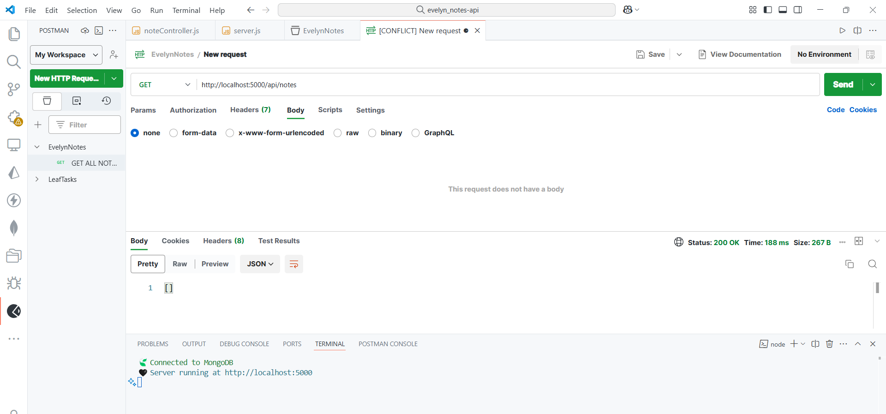
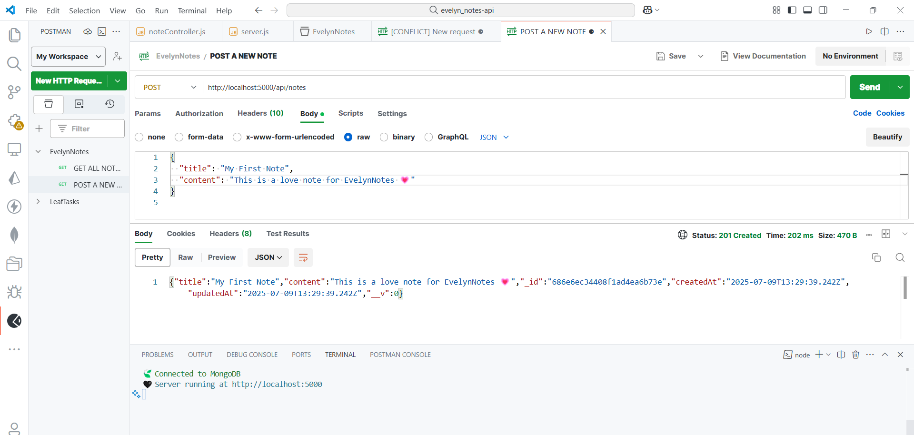
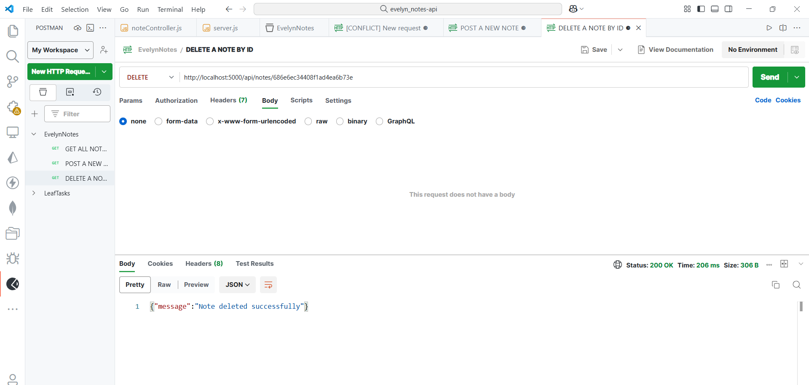
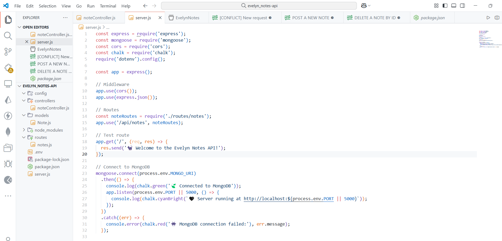

# 🐈‍⬛🍃 Evelyn Notes API

A lightweight CRUD API for creating, retrieving, and deleting personal notes – designed with clarity and soul using:

- **Express.js**
- **MongoDB (Mongoose)**
- **MVC Architecture**
- **Tested with Postman**

## Features

- `GET /api/notes` – Get all notes
- `POST /api/notes` – Create a new note
- `DELETE /api/notes/:id` – Delete a note by ID

## API Demo (Postman Preview)

### GET all notes


### POST a new note


### DELETE a note


### Server Startup


---

## Project Structure

```bash
├── controllers/
│   └── noteController.js
├── models/
│   └── Note.js
├── routes/
│   └── notes.js
├── .env
├── .gitignore
├── package.json
├── server.js

🐈‍⬛ How to Run

-- bash
npm install
npm run start

Make sure to provide your .env file with your MongoDB connection URI

